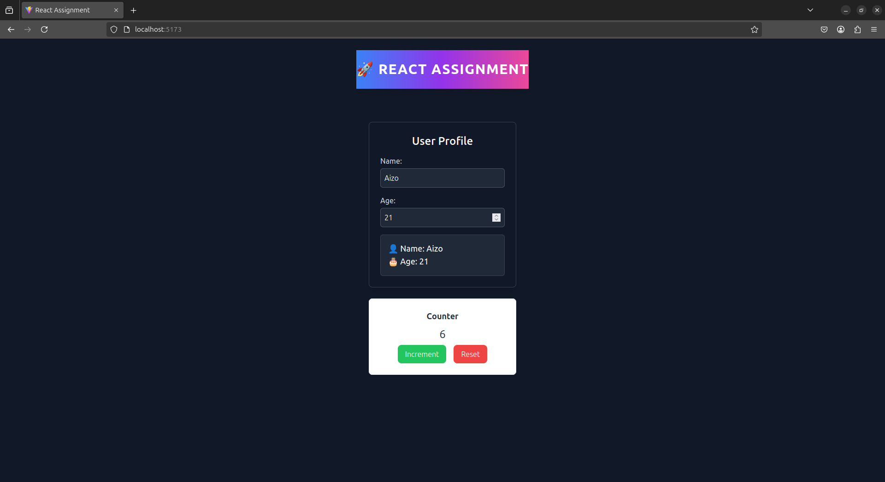

# 🚀 React.js Fundamentals Assignment

### 📌 A project demonstrating React.js concepts including **components, state management, event handling, and Tailwind CSS styling**.

---

## 📜 Description

This project is part of **Week 3: React.js Fundamentals Assignment**. 
It showcases:
- ✅ **Functional components** and their usage.
- ✅ **State management** using React’s `useState` hook.
- ✅ **Event handling** for user interactions.
- ✅ **Tailwind CSS** integration for modern and responsive styling.
- ✅ **Component-based architecture** with reusable elements.

---

## 🛠️ Tech Stack

| Technology  | Description  |
|-------------|-------------|
| ⚛️ React.js | JavaScript library for building UI components |
| 🎨 Tailwind CSS | Utility-first CSS framework for styling |
| 📝 JavaScript (ES6+) | Modern JS features used in the project |

---

## 📂 Project Structure

```bash
react-assignment/
│── src/
│   ├── components/
│   │   ├── Header.jsx    
│   │   ├── Profile.jsx   
│   │   ├── Counter.jsx   
│   ├── App.js            
│   ├── index.js          
│── public/               
│── package.json          
│── tailwind.config.js    
│── postcss.config.js     
│── .gitignore            
│── README.md             
```


## Screenshot




## 🔧 Installation & Setup

Follow these steps to clone and run the project locally:

####  1️⃣ Clone the Repository

```bash
  git clone https://github.com/PLP-Full-Stack-Development-MERN/week-3-react-js-assignment-aizocraft.git
```

```bash
   cd react-assignment
```

####  2️⃣ Install Dependencies

```bash
   npm install
```
####  3️⃣ Run the Application

```bash
   npm run dev
```

Your app should now be running at http://localhost:5173/ 🚀

## License

[MIT](https://choosealicense.com/licenses/mit/)
